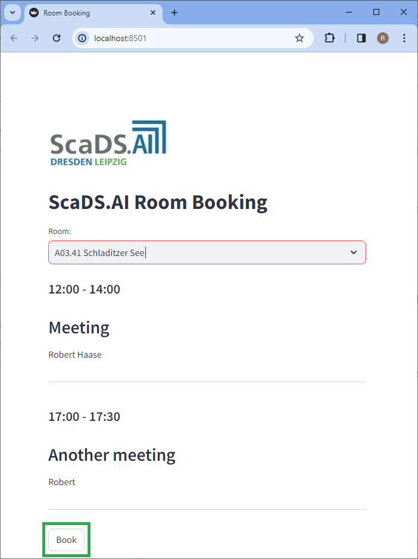
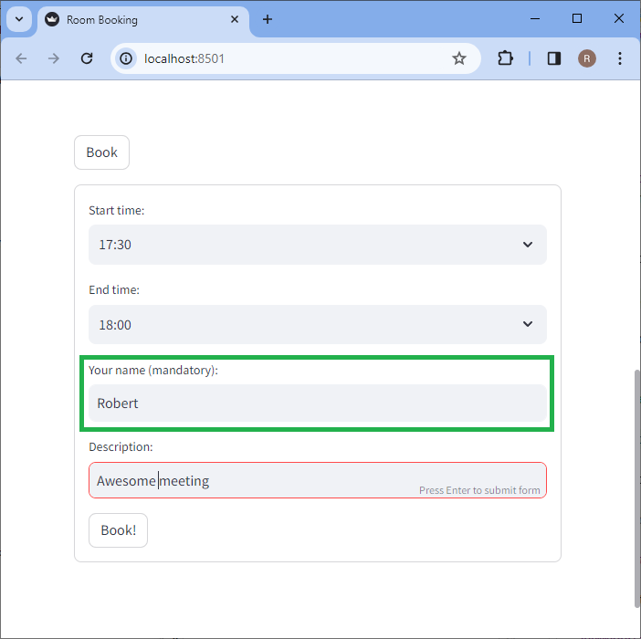
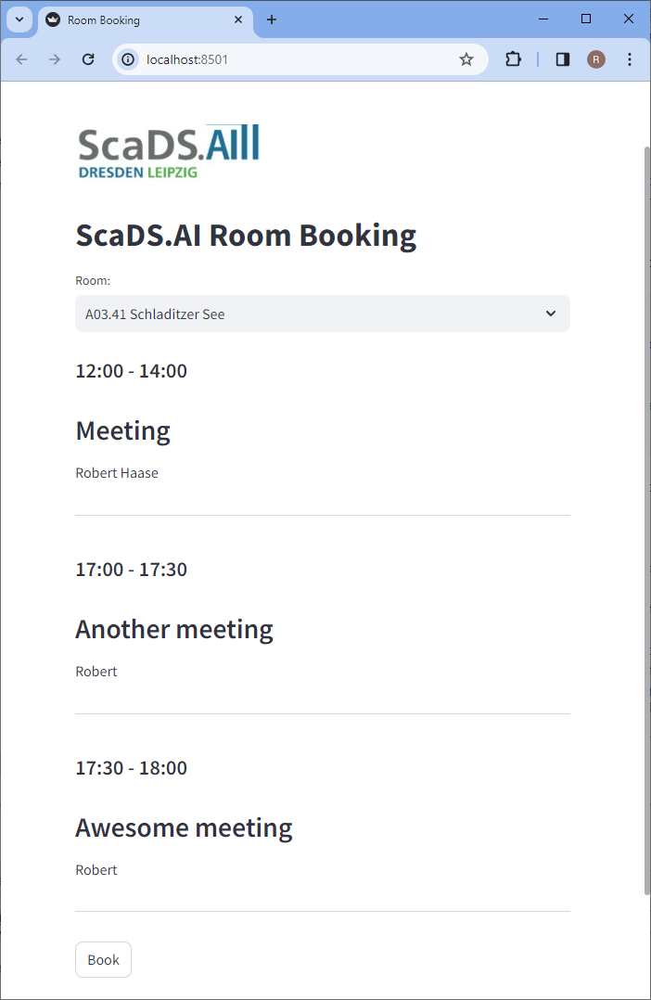

# ScaDS.AI Room Booking App


## Usage

You can try the app running this terminal command:

```commandline
scadsai-room-booking
```

A browser will pop up where you can select a room. Once a room is selected you will see the booking calendar for today.



On the bottom you can click on the `Book` button to reserve the room for the next hour, or a custom time slot. 

> [!NOTE]
> You must enter your name, otherwise the booking will fail.



After clicking on `Book!` you will see your booking in the list.



## Installation

You can install scadsai-room-booking using pip:

```commandline
git clone https://github.com/scads/scadsai_room_booking
cd scadsai_room_booking
pip install -e .
```

You need to configure these environment variables:
* `SCADSAI_ROOM_CALENDAR` (something like `https://<server>/remote.php/dav/calendars/<username>/room-bookings_shared_by_scads-ai/`)
* `SCADSAI_ROOM_USERNAME`
* `SCADSAI_ROOM_API_TOKEN`

## License

Distributed under the terms of the [BSD-3] license,
"scadsai-room-booking" is free and open source software

[BSD-3]: http://opensource.org/licenses/BSD-3-Clause

